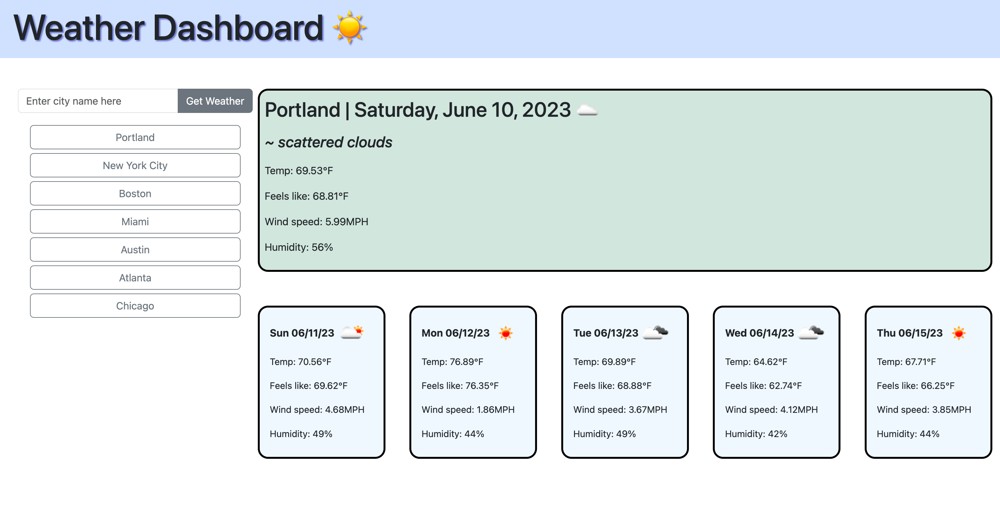

# Module 6 - Weather Dashboard

## Description

Provide a short description explaining the what, why, and how of your project. Use the following questions as a guide:

- What was your motivation?
- Why did you build this project? (Note: the answer is not "Because it was a homework assignment.")
- What problem does it solve?
- What did you learn?

## User Story

## Acceptance Criteria

## Usage

Find the link to the published GitHub Page here: https://randirose.github.io/module-6-weather-dashboard/

See a screenshot of functioning page here:  

    

## Credits

AskBCS --

## Features

Additional features in my project include:  

- Autofill widget: Autofills city names when typing into the search bar. Includes top 100 most populated US cities and 50 most populated global cities
